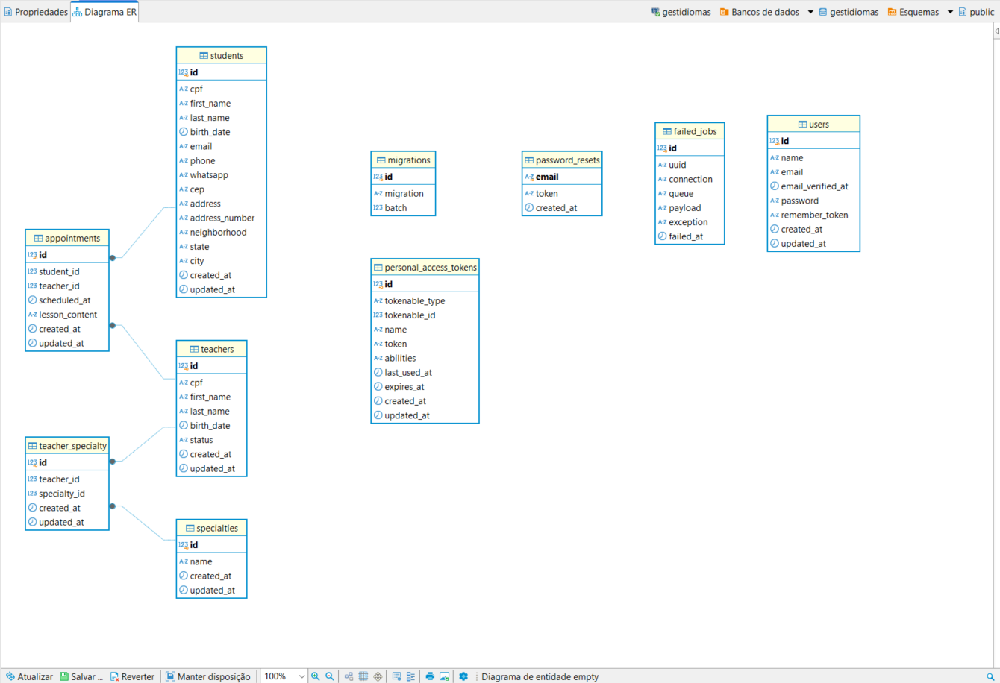

# Processo seletivo - QA

Olá, 

Bem-vindo ao GestIdiomas, um sistema desenvolvido como parte do processo seletivo para a posição de QA. Este projeto visa gerenciar professores, alunos e o agendamento de aulas em uma interface intuitiva e funcional.

## Objetivo

O objetivo do GestIdiomas é demonstrar habilidades técnicas no desenvolvimento de um sistema web que inclui:

- Gerenciamento de professores e alunos
- Agendamento e controle de aulas
- Fluxo simples e direto para organização educacional

## Informações do Projeto

- Backend: Laravel Sail, com autenticação via JWT
- Frontend: React, com comunicação via API
- Banco de Dados: PostgreSQL
- Arquitetura utilizada no backend: MVC (Models, Views e Controllers)
- Foi optado por trabalhar dentro do backend de acordo com os princípios do SOLID, a fim de melhorar a legibilidade do código.
- Ambiente de Desenvolvimento: Docker, WSL.

## Sofwares Utilizados
- VSCode
- DBeaver
- Docker e WSL
- Insomnia

## Estrutura do Projeto

- Estrutura das Pastas:
qa-junior-02611-2024-431.566.678-54

   ├── backend/gestidiomas      # Backend (API em Laravel)

   └── frontend/gestidiomas     # Frontend (React)

- Modelagem de Dados:

## Como rodar o projeto

1. Pré-requisitos:
    - Para rodar é necessário que o Docker esteja instalado, ativo e rodando na máquina.
    - Se estiver no ambiente Windows, certifique-se de que o WSL esteja configurado.

2. Clonar o Repositório:

    - git clone <url-do-repositorio>

    - cd qa-junior-02611-2024-431.566.678-54

3. Faça um backup do arquivo docker-compose.yml encontrado dentro do diretório **qa-junior-02611-2024-431.566.678-54/backend/gestidiomas**

    - cp docker-compose.yml docker-compose.yml.backup

3. Instalar as dependências:

    Instalar do Laravel Sail dentro do diretório **qa-junior-02611-2024-431.566.678-54/backend/gestidiomas**

    - composer require laravel/sail --dev

    Publicar o Dockerfile e o arquivo de configuração do Sail: 

    - php artisan sail:install

4. Copiar o arquivo .env

    - cp .env-example .env 

5. Dentro do diretório **qa-junior-02611-2024-431.566.678-54/backend/gestidiomas** crie o arquivo .env e altere com as configurações do banco de dados: 

    Exemplo de de configuração do banco de dados para o .env:

    DB_CONNECTION=pgsql

    DB_HOST=pgsql

    DB_PORT=5432

    DB_DATABASE=gestidiomas

    DB_USERNAME=your-db-username

    DB_PASSWORD=your-db-password

6. Restaure ou re-aplique suas modificações do docker-compose.yml

    Se ao rodar o comando **php artisan sail:install** o Sail sobrescreveu ou removeu o container frontend, você pode restaurá-lo manualmente a partir do backup que você fez. Copie as partes do container frontend do arquivo de backup para o novo docker-compose.yml.

7. Construa e inicie os Containers com o Sail

    - ./vendor/bin/sail up --build

8. Verificar se está funcionando

    Após o Sail iniciar os contêineres, você pode acessar o aplicativo Laravel via:

    Backend Laravel: http://localhost (ou a porta que você configurou no .env)

    Frontend React: http://localhost:3000

9. Rodar comandos no contêiner do Laravel

    Criar as tabelas do banco de dados

    - ./vendor/bin/sail artisan migrate

    Criar o usuário Admin através do Seeder 
    - ./vendor/bin/sail artisan db:seed

    Usuário para login no app que será criado com o seeder:

    - Login: admin@admin.com
    - Senha: 123456

**OBSERVAÇÃO:**
Se algum problema ocorrer, como os containers não estarem funcionando corretamente ou o Sail não estar encontrando as dependências, tente reiniciar os containers com o comando:

    ./vendor/bin/sail down

    ./vendor/bin/sail up --build

## Testes da API

- Antes do desenvolvimento do frontend, todas as URLs da API foram testadas utilizando o Insomnia. Essa abordagem foi adotada para:

- Validar as respostas da API: Garantindo que os endpoints retornam os dados corretos.
- Detectar possíveis erros: Identificando e corrigindo inconsistências no backend antes da integração.
- Acelerar o desenvolvimento do frontend: Fornecendo endpoints já funcionais e testados para serem consumidos de forma eficiente.

[Clique aqui](https://drive.google.com/drive/folders/1jAIVCD82re9bgbqXoSpWyPjgIQVZf2ga?usp=sharing) para baixar arquivo com os testes realizados no insomnia.

Para teste da API baixar o insomnia, e importar o arquivo disponibilizado através do link.

## Testes Unitários

Os testes unitários deste projeto foram implementados com o objetivo de garantir a funcionalidade e confiabilidade do sistema. Para isso, foi utilizado mocks para testar funcionalidades específicas sem depender de interações reais com o banco de dados.

Foram criados testes unitários para as seguintes situações:

**Professores**

 - Cadastrar Professor

 - Buscar Todos os Professores Cadastrados

 - Buscar Por Um Professor Especifico Através Do Seu ID

 - Editar Cadastro De Um Professor Especifico

 - Deletar Um Professor Especifico

**Alunos**

 - Cadastrar Aluno

 - Buscar Todos os Alunos Cadastrados

 - Buscar Por Um Aluno Especifico Através Do Seu ID

 - Editar Cadastro De Um Aluno Especifico

 - Deletar Um Aluno Especifico

**Agendamentos**

  - Criar Exceção de Lançamento Se Agendado Dentro de 24 Horas

  - Criar Exceção de Lançamento Se o Professor Não Estiver Disponível

  - Realizar Agendamento

Todos os testes foram realizados com sucesso, assim como apresentado na imagem abaixo.

# Funcionalidades Implementadas.

**Autenticação**

A autenticação foi implementada com o uso do JWT. 

Não foi implementado no frontend a parte de "registro do usuário", porém foi criado um seeder "UserSeeder" no lado do backend para abastecer o banco de dados com o cadastro do Admin.

**Dashboard**

No dashboard foi inserido três cards, no qual da acesso as 3 principais telas da aplicação: Gestão de Estudantes, Gestão de Agendamentos e Gestão de Professores.

**Gestão de Estudantes**

Na página de Gestão de Estudantes foram implementadas as seguintes funcionalidades:

- Listagem de Estudantes Em Ordem Alfabética;
- Barra de Pesquisa Por Nome Do Estudante;
- Cadastro;
- Edição;
- Exclusão;
- Agendamento do Estudante;

OBS: O requisito RQF4 - 4.3 "O campo cidade deve listar as cidades de acordo com o estado selecionado no campo estado" não foi implementado.

**Gestão de Professores**

Na página de Gestão de Professores foram implementadas as seguintes funcionalidades:

- Listagem de Professores;
- Barra de Pesquisa Por Nome ou CPF do Professor;
- Cadastro;
- Edição;
- Exclusão;

OBS: No lado do backend foi criado um endpoint para o cadastro de "Especialidades" no qual seria vinculado ao professor, porém não foi implementado no lado do frontend.

**Gestão de Agendamentos**

Na página de Gestão de Agendamentos foram implementadas as seguintes funcionalidades:

- Cadastro De Um Novo Agendamento;
- Edição De um Agendamento já Existente;
- Cancelamento de Agendamento.

O cadastro e edição foram criados respeitando a regras de disponibilidade do professor e também não poder ser realizado com menos de 24h de antecedência.

## Informações Extras.

- Os documentos solicitados foram enviados ao final do documento com o estudo de caso.

## Agradecimentos.

- Agradeço a oportunidade de participar deste processo seletivo.
- Qualquer dúvida entrar em contato.
    - jaine.ojuacy@gmail.com
- Atenciosamente, Jaine Oliveira.